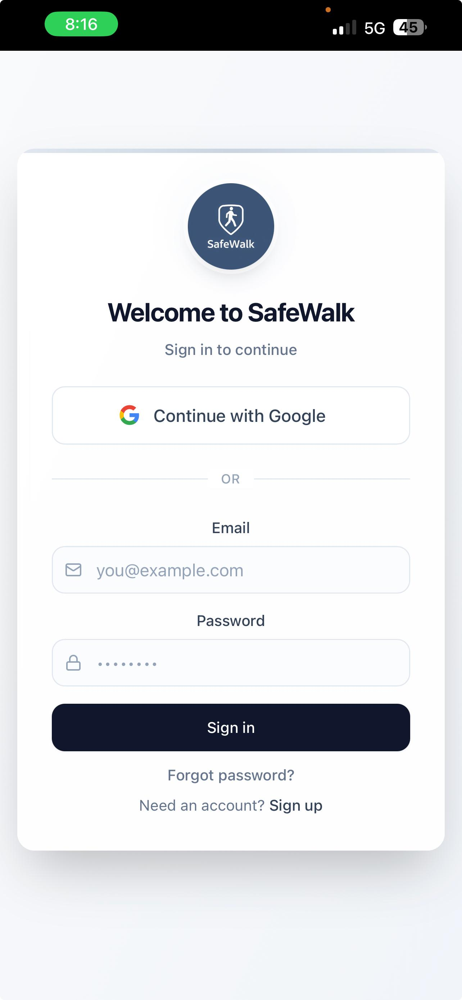
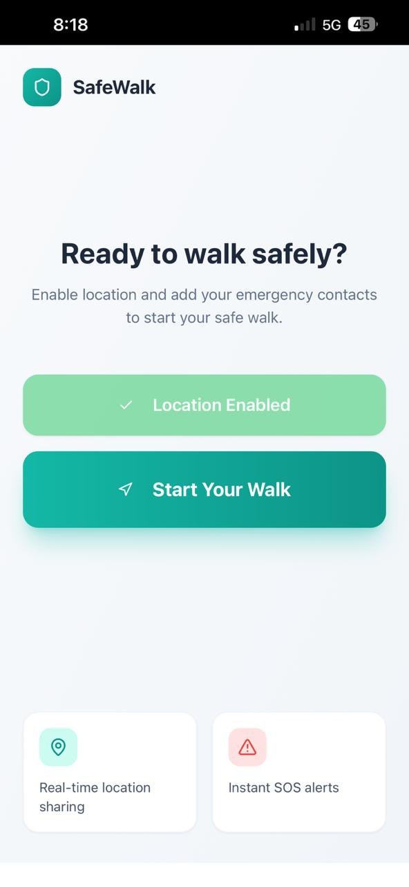
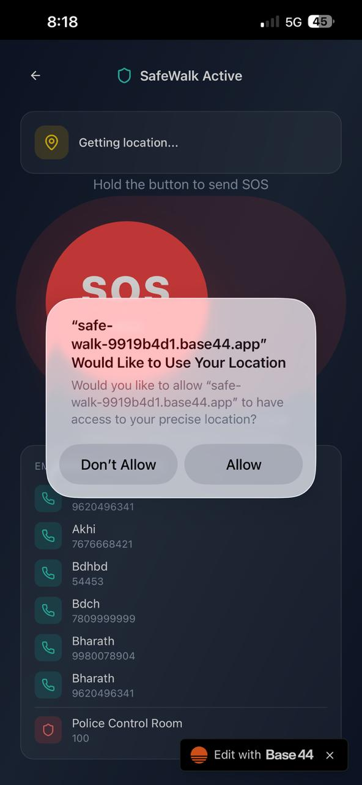
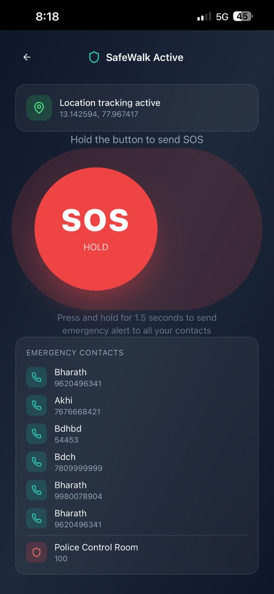
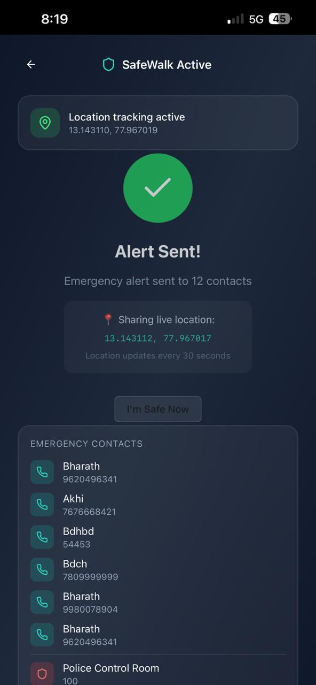
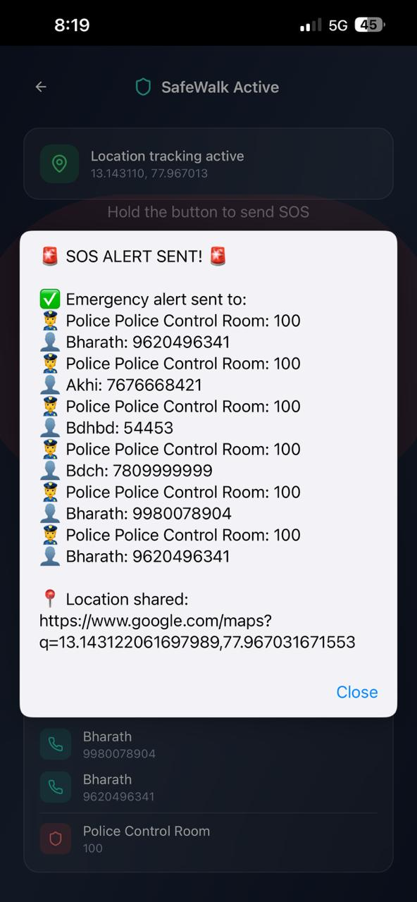
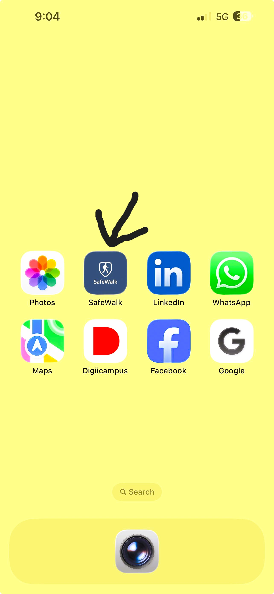

# 🛡️ SafeWalk — Student Safety Web Application

> A student safety solution built during the **Innovation Design Thinking** course (InUnity), 1st Semester MCA — completed **13 December 2025**.

---

## 📌 About This Repository.

This repository documents the **SafeWalk** project — a student safety web application designed to help students travel safely at night on campus. SafeWalk was built using **low-code/no-code platforms** (FlutterFlow and Base44) as part of a Design Thinking approach, so this repo contains **project documentation, screenshots, and design artifacts** rather than raw source code.

> 💡 No traditional source code repository exists for this project since it was built with FlutterFlow (UI) and Base44 (backend/logic). The live prototype and deployed app links are included below.

---

## 🚩 Problem Statement

Students often feel unsafe while walking alone at night due to poor lighting and lack of immediate support. There is no system to track students' locations or alert authorities in emergencies. This leads to delayed help and higher safety risks. The SafeWalk app aims to provide live GPS tracking, safe route guidance, and instant emergency alerts.

## 💡 Solution

SafeWalk offers students live GPS tracking for safer late-night travel. The app shows secure walking routes and includes a one-tap emergency alert button. When triggered, the admin instantly receives the alert along with the student's location. The admin dashboard also displays all registered students and their live movements — ensuring a quick response and improved student safety.

## 📖 Project Introduction

Student safety is a major concern, especially during late-night travel within college campuses. Many students face risks due to poorly lit paths and lack of immediate help in emergency situations. SafeWalk is a simple solution designed to support students by providing real-time location tracking and quick emergency alerts. The system helps ensure safer movement and faster response from campus security teams.

---

## ✨ Features

- 🔐 Student registration and login (with Google sign-in option)
- 📍 Live GPS location tracking, shown in real time
- 🗺️ Secure/safe walking route guidance
- 🆘 One-tap **SOS** emergency alert (press-and-hold to trigger)
- 📞 Emergency contacts list, alerted instantly on SOS
- 🚓 Direct alert integration with a Police Control Room contact
- 📡 Live location sharing updated every 30 seconds during an active alert
- 🖥️ Admin dashboard to view all registered students and their live movements
- ✅ Alert confirmation screen showing exactly who was notified and the shared location link

---

## 🛠️ Tools & Tech Stack

| Tool | Purpose |
|---|---|
| **FlutterFlow** | UI development |
| **Base44** | Logic & backend workflow |
| **Map Services** | Live GPS tracking & route guidance |

---

## 🔗 Live Links

- **Base44 Deployed App:** [safe-walk-9919b4d1.base44.app/PhoneEntry](https://safe-walk-9919b4d1.base44.app/PhoneEntry)

---

## 📸 Screenshots

| Login Screen | Start Walk Screen |
|---|---|
|  |  |
| Welcome / Sign-in screen with Google and email login | Home screen — location enabled, "Start Your Walk" |

| Location Permission | SOS Active |
|---|---|
|  |  |
| Location permission request dialog | SafeWalk Active screen with live GPS coordinates and SOS hold button |

| Alert Sent | SOS Confirmation |
|---|---|
|  |  |
| Confirmation screen after an alert is sent, with live location sharing | Detailed SOS alert confirmation listing every contact notified |

| App Icon on Home Screen |
|---|
|  |
| SafeWalk app icon installed on a phone's home screen |

---

## 🧭 How It Works

1. Student signs up / logs in to SafeWalk.
2. Student enables location access and taps **Start Your Walk**.
3. Live GPS tracking begins, and the walk screen shows the SOS button.
4. In an emergency, the student **presses and holds the SOS button for 1.5 seconds**.
5. SafeWalk instantly sends an alert — with the student's live location — to all saved emergency contacts and the Police Control Room.
6. The student's location continues to update every 30 seconds until they mark themselves **"I'm Safe Now."**
7. Admins can view all registered students and their live movements from the admin dashboard.

---

## 🎓 Project Context

- **Course:** Innovation Design Thinking (InUnity)
- **Program:** 1st Semester MCA
- **Completed:** 13 December 2025
- **Approach:** Rapid prototyping using low-code tools to validate a design-thinking solution for a real campus safety problem — from problem analysis and UI/UX design through to a working, testable prototype.

**My contributions:**
- Problem analysis and solution design
- UI/UX design in FlutterFlow
- Backend workflow and logic setup in Base44
- GPS tracking and SOS alert flow design
- Testing and validation
- Prototype deployment

---

## 🚀 Future Enhancements

- Native mobile app builds (iOS/Android) instead of a web-based prototype
- Custom safe-route algorithm using historical incident data
- Integration with actual campus security/admin systems
- Push notifications instead of link-based alerts
- Multi-language support

---

## 👤 Author

**Baire Gowda**
MCA Student, Chanakya University, Bengaluru
[Portfolio](https://bairegowda1003-portfolio.netlify.app) • [GitHub](https://github.com/bairegowda1003)
